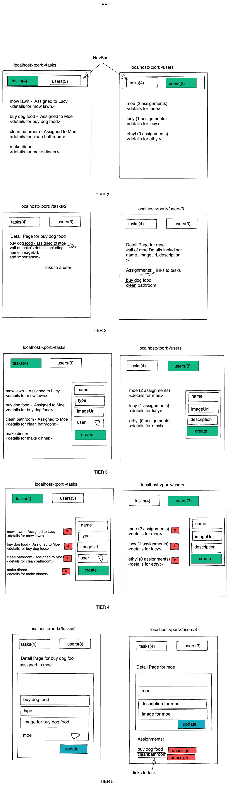

# Junior Phase Final Project

## Getting started

1. Fork and clone this repo.
2. `npm install`.
3. `npm run start`
4. name your database todos_app_db

## Details

### The Premise

You are the CTO of a company which manages Users and Tasks. Create a RESTful web platform that allows you to manage your tasks and users. Before getting started, please carefully review the expectations as outlined below.

### The tools

For this project, you must use Express to handle HTTP requests and Sequelize to interface with your database. Likewise, you must use React, Redux and React-Redux on the front-end. This means that all important state (i.e. users and tasks) must be managed by the Redux store. Unimportant state, like form data, may be managed by stateful React components. Components that display user/task data should therefore be connected to the Redux store.

- other client side libraries you will need
- redux
- react-redux
- redux-toolkit
- react-router-dom@6
- axios

### Requirements + Rubric (see rubric file)

## Requirements

- the application should be deployed
- the application needs to load without errors (blank screens are not acceptable)
- do not copy and paste previous code!
- you will have ample time to complete project, NO EXTENSIONS WILL BE GIVEN
- build incrementally!
- if you have an error, fix the error, before attempting to add functionality

### Views and Functionality

You can determine views and functionality from the requirements and wireframes shown below. If you need any clarification, please feel free to ask!

# Requirements

## Tier 1: All Users and Tasks (26/59)

### Frontend

#### User

- [ ] Write a component to display a list of all users (at least their names and images)
- [ ] Write a users sub-reducer to manage users in your Redux store
- [ ] Display the all-users component when the url matches `/users`

#### Tasks

- [ ] Write a component to display a list of all tasks (at least their names)
- [ ] Write a tasks sub-reducer (slice) to manage tasks in your Redux store
- [ ] Display the all-tasks component when the url matches `/tasks`

#### Navbar

- [ ] Add links in the navbar that can be used to navigate to the all-users view and the all-tasks view

### Backend

#### Seed

- [ ] Write a function which syncs and seeds your database when your application starts. Make sure to create some tasks that are associated with users!

#### User

- [ ] Write a route to serve up all users

- Write a `users` model with the following information:

  - [ ] firstName - not empty or null
  - [ ] lastName - not empty or null
  - [ ] imageUrl - with a default value
  - [ ] email - not empty or null; must be a valid email
  - [ ] bio - extremely large text

#### Tasks

- [ ] Write a route to serve up all tasks

- Write a `tasks` model with the following information:

  - [ ] description - not empty or null
  - [ ] category - not empty or null
  - [ ] difficulty - integer between 1 and 5
  - [ ] complete - boolean; false by default

- [ ] Tasks may be associated with at most one user. Users may be associated with many tasks

## Tier 2: Single Task and Single User (10/59)

### Frontend

#### Single User

- Write a component to display a single user with the following information:
  - [ ] The user's first and last name, image, email address, and bio
  - [ ] A list of the descriptions of all tasks in that user (or a helpful message if it doesn't have any tasks)
- [ ] Display the appropriate user's info when the url matches `/users/:userId`
- [ ] Clicking on a user from the users view should navigate to show that user

- [ ] Clicking on the name of a task in the user view should navigate to show that task in the task view

#### Single Tasks

- Write a component to display a single task with the following information:
  - [ ] The task's description, category, difficulty, and status (complete/not complete)
  - [ ] The name of the associated user (or a helpful message if it doesn't have one)
- [ ] Display the appropriate task when the url matches `/tasks/:taskId`
- [ ] Clicking on a task from the tasks view should navigate to show that task

- [ ] Clicking on the name of the assigned user in the task view should navigate to show that user in the user view

### Backend

#### User

- [ ] Write a route to serve up a single task (based on its id), _including that task's assigned user_

#### Tasks

- [ ] Write a route to serve up a single user (based on their id), _including that user's tasks_

## Tier 3: Adding a User and Adding a Task (8/59)

### Frontend

#### User

- [ ] Write a component to display a form for adding a new user that contains inputs for _at least_ the name and email address.
- [ ] Display this component as part of the users view, alongside the list of users

- Submitting the form with a valid name/address should:

  - [ ] Make an AJAX request using Axios that causes the new user to be persisted in the database
  - [ ] Add the new user to the list of users without needing to refresh the page

#### Task

- [ ] Write a component to display a form for adding a new task that contains inputs for the description, category, and difficulty
- [ ] Display this component as part of the tasks view, alongside the list of tasks

- Submitting the form with a valid description, category, and difficulty should:

  - [ ] Make an AJAX request using Axios that causes the new task to be persisted in the database
  - [ ] Add the new task to the list of tasks without needing to refresh the page

### Backend

#### User

- [ ] Write a route to add a new user

#### Task

- [ ] Write a route to add a new task

## Tier 4: Removing a User and Removing a Task (6/59)

### Frontend

#### User

- [ ] In the users view, include an `X` button next to each user
- Clicking the `X` button should:

  - [ ] Make an AJAX request that causes that user to be removed from database
  - [ ] Remove the user from the list of users without needing to refresh the page

#### Task

- [ ] In the tasks view, include an `X` button next to each task
- Clicking the `X` button should:

  - [ ] Make an AJAX request that causes that task to be removed from database
  - [ ] Remove the task from the list of tasks without needing to refresh the page

### Backend

#### User

- [ ] Write a route to remove a user (based on their id)

#### Task

- [ ] Write a route to remove a task (based on its id)

## Tier 5: Updating a User and Updating a Task (9/59)

### Frontend

#### User

- [ ] Write a component to display a form updating _at least_ a user's first name, last name, and email address
- [ ] Display this component as part of the user view
  - Submitting the form with valid data should:
- [ ] Make an AJAX request that causes that user to be updated in the database
- [ ] Update the user in the current view without needing to refresh the page

  - [ ] In the user view, display an `Unassign` button next to each of its tasks, which removes the task from the user (in the database as well as this view); hint: the task is still in the database but is no longer associated with the user

#### Task

- [ ] Write a component to display a form updating a task's description, category, and difficulty
- [ ] Display this component as part of the task view
- Submitting the form with valid data should:
- [ ] Make an AJAX request that causes that task to be updated in the database
- [ ] Update the task in the current view without needing to refresh the page

### Backend

#### User

- [ ] Write a route to update an existing user

#### Task

- [ ] Write a route to update an existing task

## Bonus Tier: Finishing Touches (15 EC)

#### Finishing Touches

- [ ] If a user attempts to add a new task or user without a required field, a helpful message should be displayed
- [ ] If a user attempts to access a page that doesn't exist (ex. `/potato`), a helpful "not found" message should be displayed
- [ ] If a user attempts to view a task/user that doesn't exist, a helpful message should be displayed
- [ ] Whenever a component needs to wait for data to load from the server, a "loading" message should be displayed until the data is available
- [ ] Overall, the app is spectacularly styled and visually stunning

#### Ordering

- [ ] Create option for tasks to be ordered based on the assigned user's lastName in all-tasks view
- [ ] Create option for tasks to be ordered based on difficulty on all-tasks view
- [ ] Create option for users to be ordered based on number of assigned tasks on all-users view

#### Filtering

- [ ] Create a filter on all-tasks view to only show tasks who are not assigned to a user
- [ ] Create a filter on the all-users view to only show users that do not have any assigned tasks

#### Seeding & Pagination

- [ ] Seed 100+ tasks and 100+ users
- [ ] Implement _front-end_ pagination for the tasks view (e.g. `/tasks?page=1` renders the first ten tasks, and `/tasks?page=2` renders tasks 11-20)
- [ ] Implement _front-end_ pagination for the users view (e.g. `/users?page=1` renders the first ten users, and `/users?page=2` renders users 11-20)
- [ ] Implement _back-end_ pagination for tasks (e.g. `/api/tasks?page=1` returns the first ten tasks' data, and `/api/tasks?page=2` returns tasks 11-20)
- [ ] Implement _back-end_ pagination for users (e.g. `/api/users?page=1` returns the first ten users' data, and `/api/users?page=2` returns users 11-20)

- `RUBRIC.md` - contains the grading rubric for additional factors, as well as the formula for calculating the total score

## Evaluation

- Requirements score (70%)
- Rubric score (30%)
- Extra credit (15% max)
